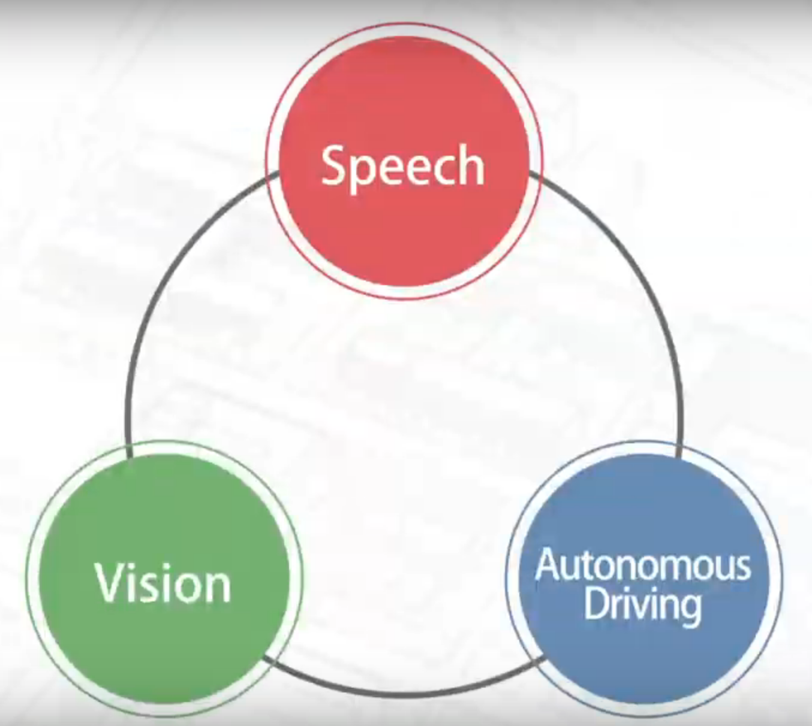
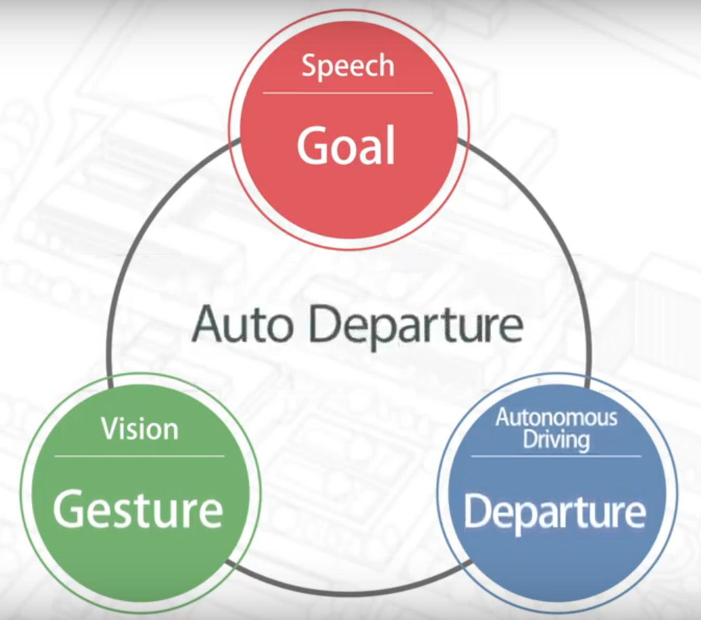
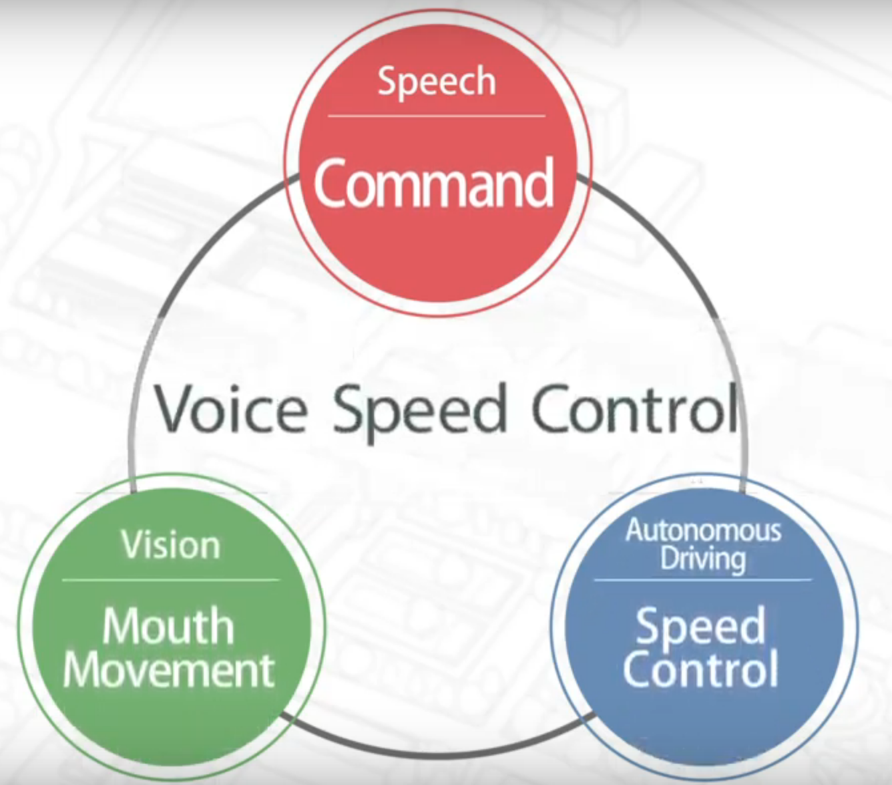
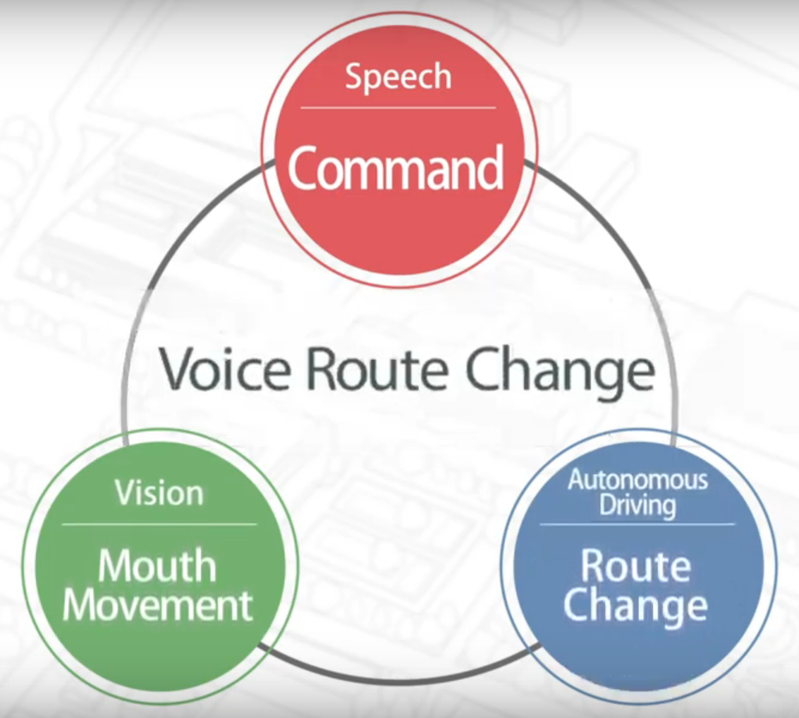
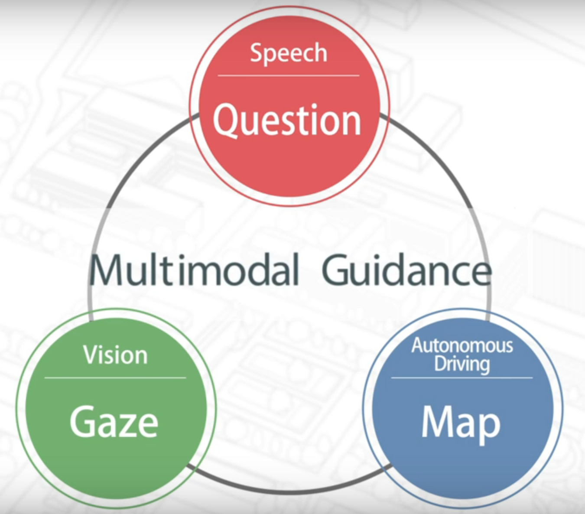
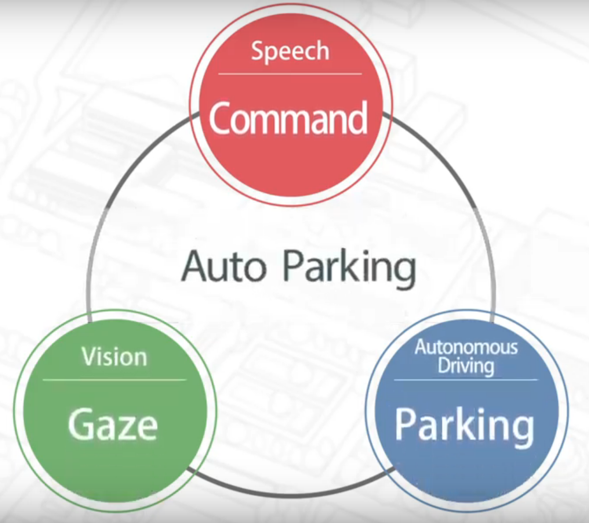
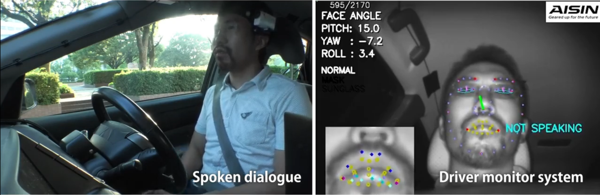

<meta name="viewport" content="width=device-width, initial-scale=1">
<link rel="stylesheet"
      type="text/css"
      href="docs/style.css"
/>

# Harmoware-HMI 
 

This repository holds the combined work of Nagoya University, Tokushima University and Aisin Seiki. 

# Table of contents
1. [Introduction](#introduction)
2. [Driver monitoring](#monitor)
3. [Installing](#install)
    1. [Environment](#environment)
    2. [How to Build](#build)
    3. [How to Start](#start)
    4. [Maps](#maps)
2. [Videos](#videos)

## <a name="introduction"></a>Multimodal Human Machine Interaction for Autonomous Vehicle Control
The implemented system combines autonomous driving software  [Autoware](https://github.com/CPFL/Autoware) (originally developed at Nagoya University, now under the [Autoware Foundation](https://www.autoware.org/)), with voice understanding and synthesis developed at Tokushima University, 3D gaze direction understanding and its relation with 3D world done at Nagoya University, all supported by a driver gesture recognition system developed at Aisin Seiki.

The following functions are implemented in our system:

* <div><p>Automatic departure using verbal interaction to specify destination and gesture recognition (nodding) to confirm or negate destinations suggested by the car. After destination is confirmed the vehicle performs path planning to find the best route towards the destination and engages autonomous driving mode.</p></div>

* <div><p>Voice speed control allows using verbal commands such as "slow down" or "speed up" to effectively control the vehicle speed. Local planning software takes the user speed control commands into consideration to generate corresponding speed profiles for the vehicle.
</p></div>

* <div><p>Dynamic on-route changes using verbal commands such as "turn right" or "go straight", with corresponding re-planning towards the destination. Route change execution is not inmediate but requires a margin distance for safety considerations. Voice route change can be combined with voice speed control and others.</p></div>

* <div><p>Interaction with vehicle is enhanced through voice and gaze to inquire the system about the immediate surrounding environment. Driver can as the vehicle questions such as "what is that?", taking into consideration current gaze direction; the car uses 3D gaze information together with semantic 3D maps to reply to the driver about objects.</p></div>

* <div><p>Similarly, voice and gaze can be used to specify where the car has to park. The driver issue commands such as "stop over there" to the vehicle takes into account the gaze direction to execute the stop command.</p></div>

<br><br>
## <a name="monitor"></a>Driver monitor system
<div>As shown on the image, the system includes a driver monitoring system located behind the steering wheel. It consists of an infrared camera with gesture recognition to detect gaze direction, whether the driver is speaking, and also whether the driver face is not detected due to steering wheel occlusions, whether his/her face is out of detection area, etc. Microphones are also located around the driver seat to ease speech recognition.</div>

<br><br>
## <a name="install"></a>Installing
The software includes:

- Autoware: fork of [CPFL/Autoware](https://github.com/CPFL/Autoware) modified for our system
- HMI: software for speech recognition and synthesis
- Gaze: software for 3D gaze processing
- Maps: point-cloud maps and vector maps

### <a name="environment"></a>Environment
This software was developed and tested on the following environment:

- Toyota Prius PHV
- CPU Intel Xeon E3-1545M 8 cores
- 32GB RAM
- NVIDIA M1000M with 4GB GPU RAM
- ROS kinetic (Ubuntu 16.04)
- (Unreal engine version and computer specs?)
- (HMI software and computer specs?)
- (AISIN hardware?)

### <a name="build"></a>How to Build
- Get the software
```
$ cd $HOME
$ git clone https://github.com/Harmoware/Harmoware-HMI.git --recurse-submodules
```
- Build Autoware
```
$ cd ~/Harmoware-HMI/Autoware
$ git submodule update --init --recursive
$ git branch feature/Harmoware-HMI
$ cd ros/src
$ catkin_init_workspace
$ cd ../
$ ./catkin_make_release
```
- Build HMI
```
here are the commands to install
```
- Build Gaze
```
here are the commands to install
```


### <a name="start"></a>How to Start
- Autoware 
```
$ cd ~/Harmoware-HMI/Autoware/ros
$ ./run
```
- HMI
```
how to start it?
```
- Gaze
```
how to start it?
```

### <a name="maps"></a>Maps

[Nagoya University](Maps/meidai)


<br><br>
## <a name="videos"></a>Videos

1. Multimodal communication enabled autonomous vehicle
[](https://www.youtube.com/watch?v=Mesx4qgONqs)
2. マルチモーダル対話型自動運転
[](https://www.youtube.com/watch?v=EkVdZUEEFwM)


